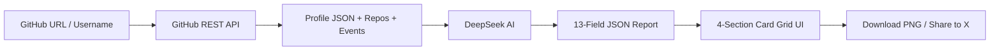

<p align="center">
  
</p>

<h1 align="center">Github-Roast</h1>

<p align="center">
  <em>AI-powered GitHub developer profile analyzer — savage roasts, sharable reports, screenshot-worthy.</em>
</p>

<p align="center">
  <a href="./README.zh.md">中文版</a>
</p>

---

## Overview

Github-Roast transforms any GitHub username or repo URL into a 13-dimension AI roast report. Enter a GitHub handle → scrape their public profile, repos & events → DeepSeek AI generates a hilarious, brutally honest analysis covering roast, tech stack, weaknesses, career advice, and more.

## Features

- **Scrape** — fetches profile, repos (up to 100), and public events via GitHub REST API (no browser needed)
- **Analyze** — sends formatted data to DeepSeek V4 Flash (free) or V4 Pro, returns structured JSON
- **13 Report Cards** — about, roast, tech stack, weaknesses, open source influence, project highlights, collaboration style, activity pulse, career advice, achievements, life suggestion
- **Download as Image** — section-by-section PNG export via html2canvas, plus "Download All"
- **Share to X** — pre-filled tweet with your report card
- **Bilingual UI** — Simplified Chinese / English toggle
- **Supports both Users & Organizations** — auto-detects account type, uses different analysis prompts

## Quick Start

### Try it online

👉 **[groast.streamlit.app](https://groast.streamlit.app)**

### Run locally

```bash
# 1. Clone
git clone https://github.com/gokuscraper/github-roast.git
cd github-roast

# 2. Install Python deps
pip install -r requirements.txt

# 3. Configure API keys
# Create .streamlit/secrets.toml with:
# GITHUB_TOKEN = "ghp_your-github-token-here"
# OPENCODE_API_KEY = "sk-your-opencode-key-here"

# 4. Run
streamlit run streamlit_app.py
```

### API Keys

| Key | Required | Where to get |
|---|---|---|
| `GITHUB_TOKEN` | Yes | [GitHub Tokens](https://github.com/settings/tokens) (public_repo scope) |
| `OPENCODE_API_KEY` | Yes | [OpenCode](https://opencode.ai) free channel |
| `SILICON_API_KEY` | Optional | [SiliconFlow Console](https://cloud.siliconflow.cn) — used as fallback |

## Project Structure

```
github-roast/
├── streamlit_app.py        # Home page — username/URL input → scrape
├── pages/
│   └── 1_Analysis.py       # 4-section analysis report page
├── lib/
│   ├── ai.py               # AI prompts (individual/org), dual API strategy
│   ├── repo_utils.py       # GitHub data formatting & stats
│   └── sidebar.py          # Sidebar navigation
├── github_scraper/
│   ├── __init__.py         # fetch_all() entry point
│   ├── client.py           # GitHub API client wrapper
│   ├── config.py           # API endpoints config
│   ├── fetcher.py          # Fetch user + repos + events
│   ├── models.py           # GitHubUser, GitHubRepo, GitHubEvent dataclasses
│   ├── parser.py           # Parse raw API data → models
│   └── storage.py          # Local JSON caching
├── locales/
│   ├── zh.json             # Chinese UI strings
│   └── en.json             # English UI strings
├── i18n.py                 # i18n helper
└── requirements.txt
```

## How It Works



1. **Input** — GitHub username, full profile URL (`https://github.com/user`), or repo URL (`https://github.com/user/repo`)
2. **Scrape** — fetches public data via GitHub REST API (`/users/{user}`, `/users/{user}/repos`, `/users/{user}/events/public`)
3. **Detect** — auto-detects User vs Organization and picks the matching analysis prompt
4. **Analyze** — formatted data sent to DeepSeek with a savage, witty prompt in your chosen language
5. **Report** — 13 cards grouped into 4 downloadable sections
6. **Share** — download section-by-section or all-at-once as PNG, or share to X

## Tech Stack

| Layer | Technology |
|---|---|
| Frontend | [Streamlit](https://streamlit.io) (single-page app) |
| AI Model | DeepSeek V4 Flash (free) / V4 Pro via [OpenCode](https://opencode.ai) + [SiliconFlow](https://siliconflow.cn) fallback |
| Data Source | [GitHub REST API](https://docs.github.com/en/rest) |
| Screenshot | [html2canvas](https://html2canvas.hertzen.com) |
| Deployment | [Streamlit Cloud](https://streamlit.io/cloud) |
| License | Apache 2.0 |

## License

[Apache 2.0](LICENSE)
