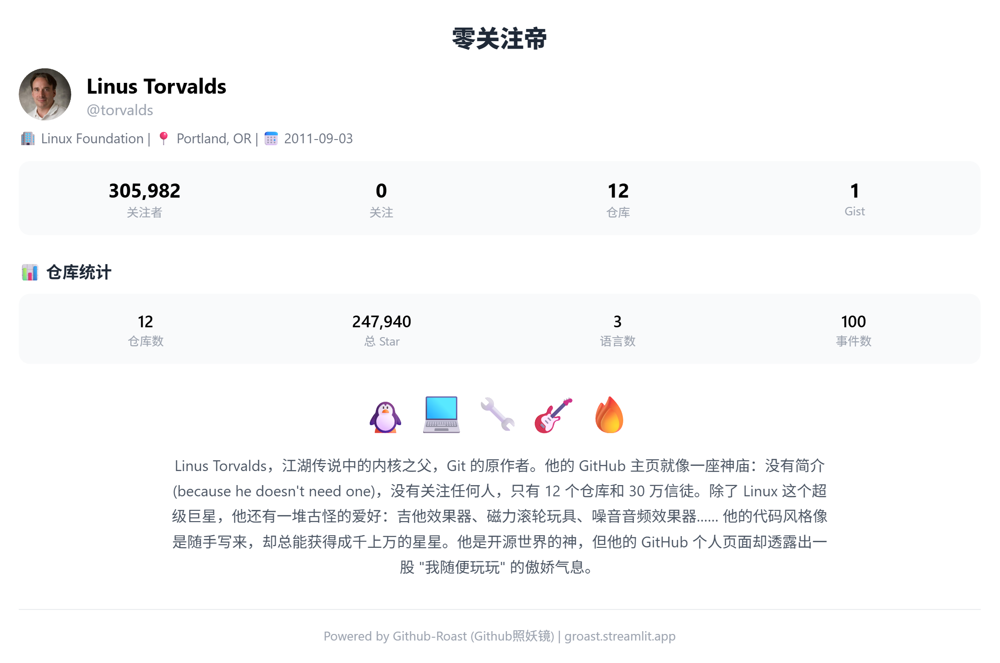
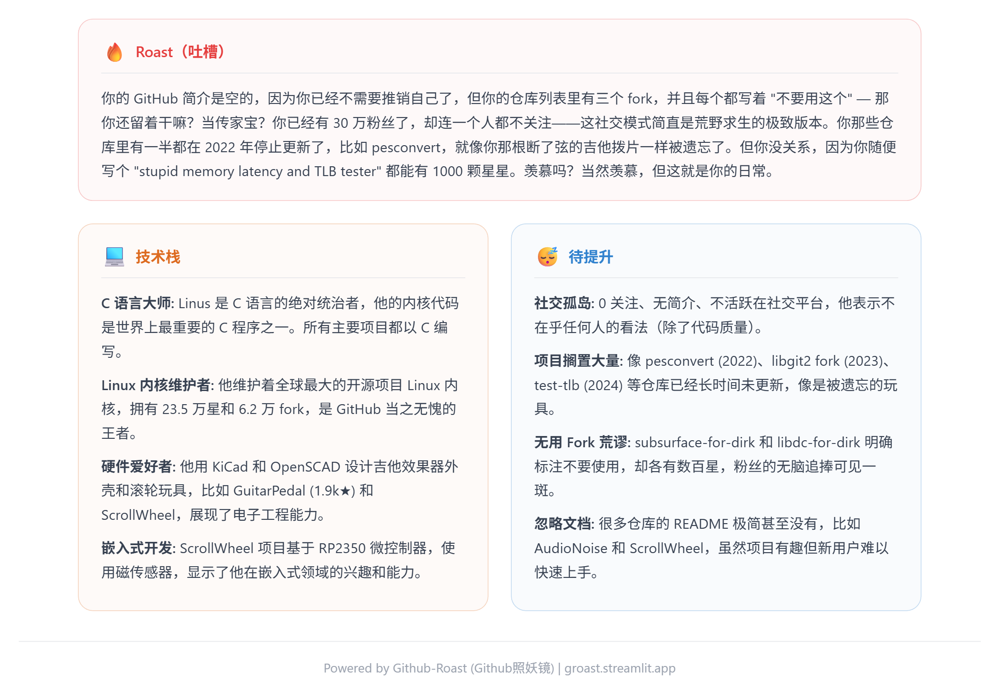
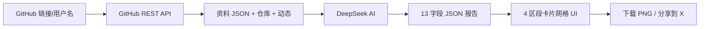

<p align="center">
  
</p>

<h1 align="center">Github照妖镜</h1>

<p align="center">
  <em>AI 驱动的 GitHub 开发者档案分析器 — 毒舌吐槽、一键截图、转发必备</em>
</p>

<p align="center">
  <a href="./README.md">English</a>
</p>

---

## 概述

Github照妖镜只需一个 GitHub 用户名或仓库链接，就能生成一份包含 13 个维度的 AI 毒舌分析报告——外加一个**独家公式算出你的 GitHub 账号值多少钱**。输入 GitHub 账号 → 抓取公开资料、仓库和动态 → DeepSeek AI 生成一份又狠又准的分析，涵盖吐槽、技术栈、弱点、职业建议等。

## 预览

<p align="center">
  
  
  <br>
  <em>资料+统计+账号估值（左）和 吐槽+技术栈+弱点（右）</em>
</p>

## 功能

- **抓取** — 通过 GitHub REST API 获取用户信息、仓库列表（最多 100 个）和公开动态，无需浏览器
- **分析** — 格式化数据后发给 DeepSeek V4 Flash（免费）或 V4 Pro，返回结构化 JSON
- **13 张报告卡片** — 简介、吐槽、技术栈、弱点、开源影响力、代表项目、协作风格、活力指数、生涯建议、成就徽章、人生建议
- **账号估值** — 基于 Star、关注者、原创仓库、Fork 数量的独家公式，算出你的 GitHub 值多少钱（¥/$）
- **下载为图片** — 支持按区段逐个下载 PNG，也支持「一键全部下载」
- **分享到 X** — 预填好推文文案的一键分享
- **中英文切换** — 简体中文 / English 实时切换
- **支持个人与组织** — 自动检测账号类型（User / Organization），使用不同的分析提示词

## 快速开始

### 在线体验

👉 **[groast.streamlit.app](https://groast.streamlit.app)**

### 本地运行

```bash
# 1. 克隆仓库
git clone https://github.com/gokuscraper/github-roast.git
cd github-roast

# 2. 安装 Python 依赖
pip install -r requirements.txt

# 3. 配置 API 密钥
# 创建 .streamlit/secrets.toml，内容：
# GITHUB_TOKEN = "ghp_your-github-token-here"
# OPENCODE_API_KEY = "sk-your-opencode-key-here"

# 4. 启动
streamlit run streamlit_app.py
```

### API 密钥

| 密钥 | 必须 | 获取地址 |
|---|---|---|
| `GITHUB_TOKEN` | 是 | [GitHub Tokens](https://github.com/settings/tokens)（public_repo 权限） |
| `OPENCODE_API_KEY` | 是 | [OpenCode](https://opencode.ai) 免费通道 |
| `SILICON_API_KEY` | 可选 | [SiliconFlow 控制台](https://cloud.siliconflow.cn) — 用作兜底 |

## 项目结构

```
github-roast/
├── streamlit_app.py        # 首页 — 输入用户名/链接 → 抓取
├── pages/
│   └── 1_Analysis.py       # 4 区段分析报告页
├── lib/
│   ├── ai.py               # AI 提示词（个人/组织），双 API 策略
│   ├── repo_utils.py       # GitHub 数据格式化 & 统计
│   └── sidebar.py          # 侧边栏导航
├── github_scraper/
│   ├── __init__.py         # fetch_all() 入口
│   ├── client.py           # GitHub API 客户端封装
│   ├── config.py           # API 端点配置
│   ├── fetcher.py          # 获取用户 + 仓库 + 动态
│   ├── models.py           # GitHubUser, GitHubRepo, GitHubEvent 数据类
│   ├── parser.py           # 解析原始 API 数据 → 模型
│   └── storage.py          # 本地 JSON 缓存
├── locales/
│   ├── zh.json             # 中文界面文案
│   └── en.json             # 英文界面文案
├── i18n.py                 # 国际化辅助
└── requirements.txt
```

## 工作原理



1. **输入** — GitHub 用户名、完整个人主页链接（`https://github.com/user`）或仓库链接（`https://github.com/user/repo`）
2. **抓取** — 通过 GitHub REST API 获取公开数据（`/users/{user}`、`/users/{user}/repos`、`/users/{user}/events/public`）
3. **识别** — 自动检测是个人用户还是组织，选择对应的分析提示词
4. **分析** — 格式化数据发给 DeepSeek，搭配毒舌提示词，使用你选择的语言
5. **报告** — 13 张卡片分为 4 个区段展示
6. **分享** — 按区段逐个下载 PNG，或一键全部下载，也可分享到 X

## 技术栈

| 层 | 技术 |
|---|---|
| 前端 | [Streamlit](https://streamlit.io)（单页应用） |
| AI 模型 | DeepSeek V4 Flash（免费）/ V4 Pro，通过 [OpenCode](https://opencode.ai) + [SiliconFlow](https://siliconflow.cn) 兜底 |
| 数据源 | [GitHub REST API](https://docs.github.com/en/rest) |
| 截图 | [html2canvas](https://html2canvas.hertzen.com) |
| 部署 | [Streamlit Cloud](https://streamlit.io/cloud) |
| 协议 | Apache 2.0 |

## 许可证

[Apache 2.0](LICENSE)
